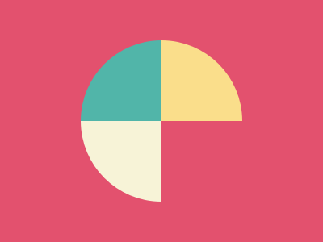

dd


## **#1 - Simply Square**

 
### Code 
    
```html
    <div></div>
    <style>
    body {
        background-color: #5d3a3a;
        margin: 0;
    }
    div {
        width: 50%;
        height: 200px;
        background: #b5e0ba;
    }
    </style>

```

## **#2 - Simply Square**

 
### Code 
```html
<div></div>
<div></div>
<div></div>
<div></div>
<style>
  body {
    background-color: #62374e;
    margin: 0;
    padding: 50px;
    display: grid;
    grid-template:
      "a  b" 
      "c  d"
    ;
    gap: 100px 200px
  }
  div {
    height: 50px;
    width: 50px;
    background-color: #fdc57b;
  }
</style>
```

## **#3 - Push Button**


### **Code**

```html
<div class="circulo"></div>
<div class="quadrado"></div>
<style>
    body {
        background-color: #6592CF;
        display: grid;
        place-items: center;
        gap: 100px 200px;
    }
    
    div {
        grid-column: -1 \ 1;
        grid-row: -1 / 1;
    }
    .circulo {
        height: 50px;
        width: 50px;
        background-color: #EEB850;
        border-radius: 50%;
        border: 50px solid #243D83;
        outline: 50px solid #6592CF;
    }
    .quadrado {
        width: 300px;
        height:150px;
        background-color: #243D83;
        z-index: -1;
    }
</style>
```

## **#4 - Ups n Downs**


### **Code**

```html
<div></div>
<div class="meio"></div>
<div></div>
<style>
  body {
    background: #62306D;
	display: flex;
   	margin:0; 
    padding: 50px;
    align-items: end;
    justify-content: center;
  }
  div {
    width: 100px;
    height: 100px;
    background: #F7EC7D;
    border-radius: 0 0 50px 50px 
  }
  .meio {
    transform: rotateX(180deg) translateY(100px);
  }
</style>
```

## **#5 - Acid Rain**


### **Code**

```html
<div class="n1"></div>
<div class="n2"></div>
<div class="n3"></div>
<style>
  body {
    background: #0B2429;
	display: grid;
   	margin:0; 
    padding: 30px 80px;
  }
  div {
    grid-column: -1 \ 1;
    grid-row: -1 / 1;
    width: 120px;
    height: 120px;
    background: #F3AC3C;
    border-radius: 50% 0 50% 50%;
  }
  .n1 {
    align-self: end;
    z-index: 3
  }
  .n2 {
    align-self: center;
    justify-self: center;
    background: #998235;
    z-index: 2
  }
  .n3 {
	border-radius: 50% ;
    justify-self: end ;
  }
</style>

```

## **#6 - Missing Slice**


### **Code**

```html
<div></div>
<style>
  body {
    background: #E3516E;
    display: grid;
    place-items: center
  }
  div {
    border-radius: 50%;
    border-top: 100px solid #51B5A9;
    border-bottom: 100px solid #E3516E;
    border-left: 100px solid #F7F3D7;
    border-right: 100px solid #FADE8B;
    transform: rotate(-45deg)
  }
</style>

```

## **#7 - Leafy Trail**


### **Code**

```html
<div class="n1"></div>
<div class="n2"></div>
<div class="n3"></div>
<style>
  body {
    background: #0B2429;
    display: grid;
    place-items: center;
    margin: 0;
    padding: 75px
  }
  div {
  	grid-column: -1 / 1;
  	grid-row: -1 / 1;
    width: 150px;
    height: 150px;
    border-radius: 100px 0;
  }
  .n1 {
    background: #1A4341;
    justify-self: start;
  }
  .n2 {	
    background: #998235;
    justify-self: center;
  }
  .n3 {
    background: #F3AC3C;
    justify-self: end;
  }
</style>

```


## **# - Ups n Downs**


### **Code**

```html
    

```
